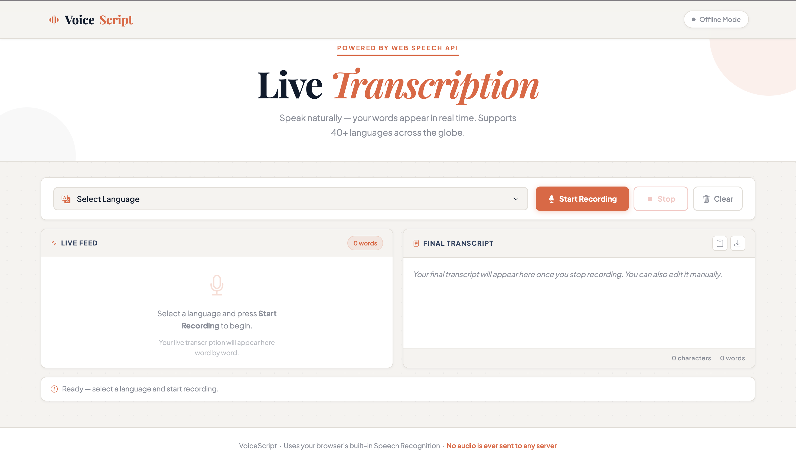

# 🎙️ VoiceScript — Live Transcription

> A clean, browser-based live transcription tool powered by the Web Speech API. Speak naturally and watch your words appear in real time — no accounts, no servers, no audio uploads.

**[📁 Repository](https://github.com/suryaxo03/VoiceScript)**

---

## 📸 Preview




---

## ✨ Features

- 🎤 **Real-time transcription** — words appear as you speak, live
- 🌍 **40+ languages** — Indian languages, European, Asian, Middle Eastern, and more
- ✏️ **Editable transcript** — clean up the final text before saving
- 📋 **Copy to clipboard** — one click to copy your transcript
- 💾 **Download as .txt** — saves with a timestamped filename
- 🔒 **Fully private** — no audio ever leaves your device
- 📱 **Responsive** — works on desktop and mobile browsers

---

## 🌐 Browser Compatibility

> ⚠️ **Important:** For the best experience — especially for **Indian languages** — please use **Google Chrome** or **Microsoft Edge**. Safari has limited speech recognition support and may not support all languages.

| Browser | Support |
|---|---|
| Google Chrome | ✅ Full support (recommended) |
| Microsoft Edge | ✅ Full support |
| Firefox | ⚠️ Partial — some languages may not work |
| Safari | ❌ Limited — Indian languages not supported |

---

## 🚀 Getting Started

### Option 1 — Use the Live Version

Simply visit the live site:

```
https://suryaxo03.github.io/VoiceScript
```

No installation needed.

---

### Option 2 — Run Locally

1. **Clone the repository**

```bash
git clone https://github.com/suryaxo03/VoiceScript.git
cd VoiceScript
```

2. **Open in your editor**

```bash
code .
```

3. **Launch with Live Server**

In VSCode, right-click `index.html` → **Open with Live Server**.

Or simply open `index.html` directly in Google Chrome.

> ⚠️ The Web Speech API requires either a live server or HTTPS. Opening the file directly via `file://` may not work in all browsers.

---

## 🎯 How to Use

### Step 1 — Select Your Language

Click the **language dropdown** at the top and choose your preferred language from the list. Languages are grouped by region for easy navigation.

> 💡 **Tip:** If you're transcribing Indian languages like Tamil, Hindi, or Telugu — make sure you're using **Google Chrome** for accurate results.

---

### Step 2 — Start Recording

Click the **Start Recording** button. Your browser will ask for microphone permission — click **Allow**.

Once recording begins you'll see:
- A **red recording indicator** with an animated waveform
- The navbar status pill will change to **Recording**

---

### Step 3 — Speak

Speak naturally into your microphone. You'll see two types of text appear in the **Live Feed** panel on the left:

- **Solid lines** (with a coloured left border) — finalised text that won't change
- *Italic lines* — interim text currently being processed, may still change

> 💡 **Tip:** Speak at a natural pace. Pausing briefly between sentences helps the recogniser produce cleaner results.

---

### Step 4 — Stop Recording

Click the **Stop** button when you're done. The **Final Transcript** panel on the right will be populated with all your finalised text — ready to review and edit.

---

### Step 5 — Review & Edit

The **Final Transcript** panel is fully editable. Click anywhere inside it to:
- Fix any words that were misheard
- Add punctuation
- Format the text however you need

The word count and character count update live as you type.

---

### Step 6 — Save Your Transcript

You have two options:

**Copy to clipboard** — Click the clipboard icon (📋) in the Final Transcript panel header to copy everything. Then paste into any app — Google Docs, Word, Notes, etc.

**Download as .txt** — Click the download icon (⬇️) to save the transcript as a plain text file. The file is automatically named with the language and date, e.g.:

```
voicescript-Tamil-2026-02-28.txt
```

---

### Step 7 — Start a New Session

Click the **Clear** button to wipe both panels and start fresh. Your previous transcript will be cleared, so make sure you've saved it first.

---

## 🌍 Supported Languages

<details>
<summary>Click to expand the full language list</summary>

### 🇮🇳 Indian Languages
| Language | Code |
|---|---|
| English (India) | `en-IN` |
| Hindi | `hi-IN` |
| Tamil | `ta-IN` |
| Telugu | `te-IN` |
| Kannada | `kn-IN` |
| Malayalam | `ml-IN` |
| Marathi | `mr-IN` |
| Gujarati | `gu-IN` |
| Punjabi | `pa-IN` |
| Bengali | `bn-IN` |

### 🌍 English Variants
| Language | Code |
|---|---|
| English (US) | `en-US` |
| English (UK) | `en-GB` |
| English (Australia) | `en-AU` |
| English (Canada) | `en-CA` |

### 🌐 European Languages
French, German, Spanish, Italian, Portuguese, Dutch, Polish, Russian, Swedish, Norwegian, Danish, Finnish, Greek, Turkish

### 🌏 Asian Languages
Chinese (Simplified & Traditional), Japanese, Korean, Thai, Vietnamese, Indonesian, Malay

### 🌍 Middle Eastern Languages
Arabic (Saudi Arabia & Egypt), Hebrew, Persian (Farsi), Urdu

</details>

---

## 🛠️ Tech Stack

| Technology | Purpose |
|---|---|
| HTML5 | Structure |
| CSS3 | Styling & animations |
| Vanilla JavaScript | App logic |
| Web Speech API | Speech recognition (built into Chrome/Edge) |
| Bootstrap 5 | Responsive layout |
| Bootstrap Icons | UI icons |
| Google Fonts | Typography (Playfair Display + Plus Jakarta Sans) |

> **No frameworks. No dependencies. No backend.** Everything runs in your browser.

---

## 📁 Project Structure

```
VoiceScript/
├── index.html       # App structure and markup
├── styles.css       # All styling and animations
├── app.js           # Speech recognition logic and UI behaviour
└── README.md        # You're reading this!
```

---

## ⚙️ Optional: Backend / WebSocket Support

VoiceScript includes optional WebSocket support for forwarding transcripts to a backend server. By default, the app runs in **Offline Mode** — all transcription happens locally in the browser with no server required.

If you have a Node.js WebSocket server running at `ws://localhost:3000`, the app will connect to it automatically and forward each finalised transcript segment as a JSON message:

```json
{
  "action": "transcript",
  "text": "This is what I said.",
  "isFinal": true
}
```

If no server is found, the app silently falls back to Offline Mode — no errors, full functionality.

---

## 🤝 Contributing

Contributions are welcome! To contribute:

1. Fork the repository
2. Create a feature branch: `git checkout -b feature/your-feature`
3. Commit your changes: `git commit -m "Add your feature"`
4. Push to the branch: `git push origin feature/your-feature`
5. Open a Pull Request

---

## 🧠 Future Improvements

Adding support to the unstructured output text that turns into neatly organised and structured text.

---

## 📄 License

This project is open source and available under the [MIT License](LICENSE).

---

## 👤 Author

**Your Name**
- GitHub: [@suryaxo03](https://github.com/suryaxo03)
- Portfolio: [suryaxo03.github.io](https://suryaxo03.github.io)

---

<p align="center">Made with ❤️ — No audio ever leaves your device.</p>
